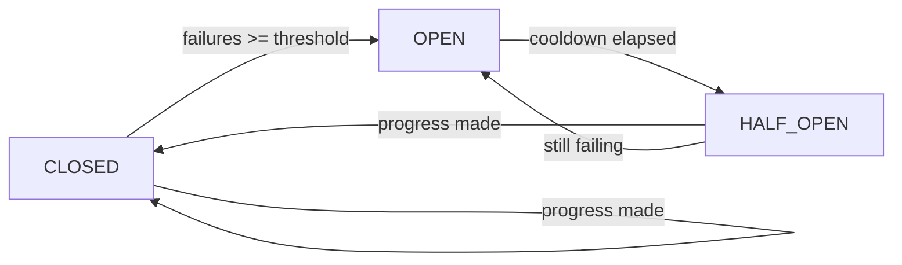

The circuit breaker is a safety mechanism that detects stagnation (repeated iterations without progress) and stops the loop before wasting tokens and cost.

## Why Circuit Breakers?

Autonomous loops can sometimes get stuck:
- Task repeatedly fails the same way
- Agent misunderstands requirements and rebuilds incorrectly
- External dependencies are missing but not detected as blocking
- Review-fix cycle doesn't converge on a solution

Without protection, these scenarios consume tokens and cost while making no progress. The circuit breaker detects this pattern and stops execution.

## How It Works

The circuit breaker tracks progress using a **status signature** of all tasks:

```rust
// src/spec.rs:168-181
pub fn status_signature(spec_dir: &Path) -> String {
    let mut signature = String::new();
    for file in list_task_files(spec_dir) {
        let name = file.file_name()
            .map(|s| s.to_string_lossy().to_string())
            .unwrap_or_default();
        signature.push_str(&name);
        signature.push(':');
        signature.push_str(get_task_status(&file).as_str());
        signature.push(';');
    }
    signature
}
```

Example signature:
```
01-models.md:done;02-routes.md:in-progress;03-tests.md:pending;
```

After each iteration:
1. Compute current signature
2. Compare to signature from previous iteration
3. If unchanged, increment failure counter
4. If changed (progress made), reset failure counter to 0
5. If failures reach threshold, trip the circuit breaker

## Circuit States

The circuit breaker has three states:

<CardGroup cols={3}>
  <Card title="CLOSED" icon="circle-check" color="green">
    Normal operation. Loop executes normally.
    
    **Active when:**
    - Failures below threshold
    - Progress being made
  </Card>
  <Card title="OPEN" icon="circle-xmark" color="red">
    Circuit tripped. Loop stops immediately.
    
    **Active when:**
    - Failure threshold reached
    - No progress for N iterations
    
    **Behavior:**
    - Blocks all execution
    - Enforces cooldown period
  </Card>
  <Card title="HALF_OPEN" icon="circle-half-stroke" color="yellow">
    Testing after cooldown. Allows one attempt.
    
    **Active when:**
    - Cooldown period elapsed
    
    **Behavior:**
    - Allows one build attempt
    - Returns to CLOSED if progress made
    - Returns to OPEN if still failing
  </Card>
</CardGroup>

## State Transitions



## Implementation

The circuit breaker is stored per session at `.spec-loop/sessions/<session-id>/.circuit_breaker.json`:

```json
{
  "state": "OPEN",
  "failures": 5,
  "opened_at": "2026-03-01T14:30:22Z"
}
```

### Loading Circuit State

```rust
// src/circuit_breaker.rs:34-56
pub fn load(session_dir: &Path) -> Result<Self> {
    let path = session_dir.join(".circuit_breaker.json");
    let mut cb = Self {
        path,
        state: CircuitState::Closed,
        failures: 0,
        opened_at: String::new(),
    };

    if cb.path.exists() {
        let text = fs::read_to_string(&cb.path)?;
        if let Ok(data) = serde_json::from_str::<CircuitStateFile>(&text) {
            cb.state = data.state;
            cb.failures = data.failures;
            cb.opened_at = data.opened_at;
        }
    }

    Ok(cb)
}
```

### Checking Circuit State

```rust
// src/circuit_breaker.rs:59-98
pub fn check(&mut self, cooldown_minutes: u32, ui: &Ui) -> Result<bool> {
    match self.state {
        CircuitState::Closed | CircuitState::HalfOpen => Ok(true),
        CircuitState::Open => {
            let now = Utc::now().timestamp();
            let elapsed_min = ((now - opened_at).max(0) / 60) as u32;
            if elapsed_min >= cooldown_minutes {
                self.state = CircuitState::HalfOpen;
                self.save()?;
                ui.step_warn(
                    "Circuit breaker: HALF_OPEN (cooldown elapsed, allowing one attempt)",
                );
                return Ok(true);
            }

            let remaining = cooldown_minutes.saturating_sub(elapsed_min);
            ui.step_error(&format!(
                "Circuit breaker: OPEN ({}m cooldown remaining)",
                remaining
            ));
            Ok(false)
        }
    }
}
```

### Recording Progress

```rust
// src/circuit_breaker.rs:100-116
pub fn record(&mut self, made_progress: bool, threshold: u32, ui: &Ui) -> Result<()> {
    if made_progress {
        self.failures = 0;
        self.state = CircuitState::Closed;
    } else {
        self.failures = self.failures.saturating_add(1);
        if self.failures >= threshold {
            self.state = CircuitState::Open;
            self.opened_at = now_iso();
            ui.step_error(&format!(
                "Circuit breaker: OPEN after {} iterations without progress",
                self.failures
            ));
        }
    }
    self.save()
}
```

## Default Parameters

spec-loop uses these default values:

| Parameter | Default | Description |
|-----------|---------|-------------|
| Failure threshold | 5 | Iterations without progress before tripping |
| Cooldown period | 5 minutes | Time before allowing retry after trip |

<Note>
These are currently hardcoded in the source. Future versions may make them configurable.
</Note>

## Tripped Circuit Behavior

When the circuit breaker trips:

**Console output:**
```bash
✗ Circuit breaker: OPEN after 5 iterations without progress

Exit: CIRCUIT_OPEN
Session: .spec-loop/sessions/20260301_143022_user-auth/
```

**Exit reason in session.json:**
```json
{
  "exit_reason": "CIRCUIT_OPEN",
  "ended_at": "2026-03-01T14:35:45Z"
}
```

**State file:**
```json
{
  "state": "OPEN",
  "failures": 5,
  "opened_at": "2026-03-01T14:35:45Z"
}
```

## Recovery Process

<Steps>
  <Step title="Identify the Issue">
    Check session logs to understand why progress stalled:

    ```bash
    cat .spec-loop/sessions/<session-id>/run.md
    ```

    Look for:
    - Same error repeating across iterations
    - Task status not changing
    - Review feedback not being addressed
    - Missing dependencies or external blockers
  </Step>

  <Step title="Fix the Root Cause">
    Common fixes:

    **Missing dependencies:**
    ```bash
    # Install missing package
    npm install required-package

    # Add credentials to .env
    echo "API_KEY=..." >> .env
    ```

    **Task scope too large:**
    - Split task into smaller subtasks
    - Update task file with clearer acceptance criteria

    **AGENTS.md conflicts:**
    - Review project rules for contradictions
    - Clarify ambiguous requirements

    **Code issue:**
    - Manually fix the failing code
    - Update task status: `in-review → pending`
  </Step>

  <Step title="Wait for Cooldown (or Reset)">
    **Option 1: Wait 5 minutes**
    
    The circuit automatically transitions to HALF_OPEN, allowing one retry attempt.

    **Option 2: Reset circuit manually**
    
    Delete the circuit state file:
    ```bash
    rm .spec-loop/sessions/<session-id>/.circuit_breaker.json
    ```

    <Warning>
    Only reset manually if you've fixed the root cause. Otherwise, the circuit will trip again immediately.
    </Warning>
  </Step>

  <Step title="Resume Execution">
    ```bash
    spec-loop run --resume
    ```

    The loop continues with HALF_OPEN or CLOSED state (depending on cooldown vs manual reset).
  </Step>
</Steps>

## Progress Detection Examples

**Progress made (resets failures):**
```
# Before
01-models.md:pending;02-routes.md:pending;

# After iteration
01-models.md:in-progress;02-routes.md:pending;
```
Status changed → progress detected → failures = 0.

**No progress (increments failures):**
```
# Before
01-models.md:in-review;02-routes.md:pending;

# After build → review (FAIL) → fix → review (FAIL)
01-models.md:in-review;02-routes.md:pending;
```
Status unchanged → no progress → failures += 1.

**Completing tasks (progress):**
```
# Before
01-models.md:in-review;02-routes.md:pending;

# After review (PASS)
01-models.md:done;02-routes.md:pending;
```
Task marked done → progress detected → failures = 0.

## Preventing Circuit Trips

<CardGroup cols={2}>
  <Card title="Write Clear Acceptance Criteria" icon="bullseye">
    Vague criteria lead to misunderstandings.
    
    **Bad:** "API works"
    
    **Good:** "POST /api/users returns 201 with {id, email}; email is validated"
  </Card>
  <Card title="Define Explicit Dependencies" icon="diagram-project">
    Missing dependencies cause repeated failures.
    
    Document in task files:
    ```markdown
    > Depends on: 1, 2
    ```
    
    And in spec.md task index.
  </Card>
  <Card title="Use Verify Commands" icon="check-circle">
    Catch errors early.
    
    Configure in `.speclooprc`:
    ```bash
    VERIFY_COMMAND="npm run lint && npm run typecheck"
    ```
  </Card>
  <Card title="Keep Tasks Small" icon="puzzle-piece">
    Large tasks are harder to complete in one cycle.
    
    Aim for:
    - S tasks: 1-2 files
    - M tasks: 3-5 files
    - L tasks: 5+ files (split if possible)
  </Card>
</CardGroup>

## Design Rationale

The circuit breaker implements the **fail-fast** principle:

> Better to stop early and alert the user than waste resources on repeated failures.

Key decisions:

**Why status signature?**
Task status changes are the canonical measure of progress. If tasks aren't moving through `pending → in-progress → in-review → done`, the loop is stuck.

**Why 5 iterations?**
Balances patience (allowing review-fix cycles to converge) with responsiveness (catching real stagnation quickly).

**Why 5-minute cooldown?**
Gives time for external issues (API rate limits, temporary service outages) to resolve, while not being so long that users forget about the paused run.

**Why HALF_OPEN state?**
Allows testing if the issue has resolved (e.g., rate limit reset) without requiring manual intervention.

## Future Enhancements

Potential improvements (not yet implemented):

- Configurable threshold and cooldown via `.speclooprc`
- Exponential backoff for repeated trips
- Per-task circuit breakers (isolate problematic tasks)
- Automatic marking of stalled tasks as `blocked`
- Telemetry on circuit trip reasons

## Next Steps

<CardGroup cols={2}>
  <Card title="Session Logs" icon="file-lines" href="/concepts/session-logs">
    Learn about session logging
  </Card>
  <Card title="How It Works" icon="rotate" href="/concepts/how-it-works">
    Review the build-review-fix loop
  </Card>
</CardGroup>
