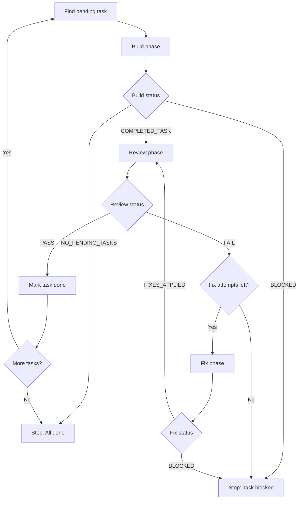

spec-loop is an autonomous development loop that implements features from spec files by executing a three-phase cycle: **build → review → fix**, repeating until all tasks are complete or a safety mechanism triggers.

## The Core Loop

For each task in your spec, spec-loop runs Claude Code through three distinct phases:

<Steps>
  <Step title="Build Phase">
    Claude implements exactly one pending task from the spec.

    **Workflow:**
    1. Reads `spec.md`, `progress.md`, and all task files
    2. Identifies next eligible task (status `pending`, dependencies met)
    3. Claims task by updating status: `pending → in-progress`
    4. Implements the requested scope
    5. Runs verification and tests
    6. Updates task documentation and sets status to `in-review`
    7. Commits code changes (spec files never staged)

    **Exit status:**
    - `COMPLETED_TASK` — Task implemented and ready for review
    - `BLOCKED` — Cannot proceed (missing dependencies, external issue)
    - `NO_PENDING_TASKS` — All tasks complete

    <Info>
    The build phase **never** marks a task as `done`. Only a successful review pass controls final completion.
    </Info>
  </Step>

  <Step title="Review Phase">
    An independent reviewer verifies the implementation without trusting claims.

    **Workflow:**
    1. Reviews only the git diff range for this task
    2. Checks project conventions from `AGENTS.md`
    3. Verifies task completeness and acceptance criteria
    4. Runs verification and test commands
    5. Reports issues by severity:
       - **Must fix:** Correctness, broken behavior, failing tests, security issues
       - **Should fix:** Improvements that don't block completion
       - **Suggestions:** Optional ideas

    **Exit status:**
    - `PASS` — No must-fix issues, task complete
    - `FAIL` — Must-fix issues found, needs correction

    <Note>
    If verify or test commands fail, the reviewer automatically treats this as a must-fix issue.
    </Note>
  </Step>

  <Step title="Fix Phase">
    Applies corrections from review findings.

    **Workflow:**
    1. Reads review findings
    2. Fixes all must-fix items
    3. Fixes should-fix items when low-risk and quick
    4. Re-runs verification and tests
    5. Commits changes with explicit file staging

    **Exit status:**
    - `FIXES_APPLIED` — Corrections complete, ready for re-review
    - `BLOCKED` — Cannot fix (requires human intervention)

    The loop then returns to the review phase to verify fixes.
  </Step>
</Steps>

## Review-Fix Cycle

spec-loop allows up to `--max-review-fix-loops` attempts (default: 3) to pass review:

```
build → review (FAIL) → fix → review (FAIL) → fix → review (PASS) ✓
```

If review still fails after max attempts, the task is marked **blocked** and the loop stops.

## Task Completion Flow



## Iteration Limits

spec-loop enforces safety limits to prevent infinite loops:

| Limit | Default | Override | Purpose |
|-------|---------|----------|----------|
| `max-loops` | 25 | `--max-loops <n>` | Total iterations before stopping |
| `max-review-fix-loops` | 3 | `--max-review-fix-loops <n>` | Review-fix attempts per task |
| `max-tasks` | unlimited | `--max-tasks <n>` | Tasks to complete in one run |

<Warning>
If max iterations is reached, the loop exits with status `MAX_ITERATIONS` and you can resume with `--resume`.
</Warning>

## Execution Output

Each iteration displays real-time progress:

```bash
── Iteration 1 of 25 ─────────────────────────────

● build
    → session  model=claude-opus-4-6  id=9af31c8d
    ⠹ #4 Bash npm run lint && npm run typecheck 00:12
    → Read     AGENTS.md
    → Write    src/api/routes/auth.ts
    → Bash     npm run lint && npm run typecheck
    ✓ result   45s ◆ $0.12 ◆ 8 tools

● review
    ✓ PASS     0 must-fix ◆ 0 should-fix

✓ Task 4 complete → 3 remaining
```

## Prompts and Instructions

spec-loop uses specialized prompts for each phase that enforce:

- **Scope constraints** — Implement only the requested task
- **Status contracts** — Each phase must output specific status lines
- **Verification** — Run verify/test commands before finishing
- **Git discipline** — Never stage spec files, explicit file staging only

Prompts are dynamically generated based on:
- Project configuration (`.speclooprc`)
- Spec directory location
- Git state (for review diff ranges)
- Review findings (for fix phase)

See the source code at `src/prompts.rs:5-86` for the exact prompt templates.

## Skip Review Mode

Use `--skip-review` to run build-only cycles without review verification:

```bash
spec-loop run --skip-review
```

Useful for rapid prototyping, but not recommended for production features.

## Next Steps

<CardGroup cols={2}>
  <Card title="Specs and Tasks" icon="file-lines" href="/concepts/specs-and-tasks">
    Learn how spec files are structured
  </Card>
  <Card title="Circuit Breaker" icon="shield-halved" href="/concepts/circuit-breaker">
    Understand stagnation protection
  </Card>
</CardGroup>
