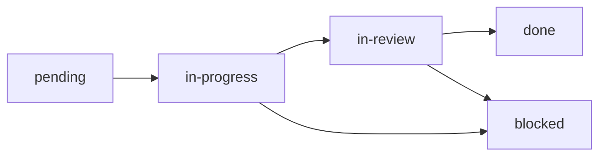

spec-loop organizes work using **specs** (feature directories) and **tasks** (individual markdown files). This structure enables autonomous agents to understand scope, dependencies, and progress.

## Spec Directory Structure

A spec is a directory under `.agents/specs/` containing:

```bash
.agents/specs/<feature-name>/
├── spec.md           # Feature overview, requirements, design
├── progress.md       # Implementation log (appended after each task)
└── tasks/
    ├── 01-add-models.md
    ├── 02-add-routes.md
    ├── 03-add-tests.md
    └── ...
```

<Info>
Use the `/spec-loop-spec` skill in Claude Code to generate properly structured specs automatically.
</Info>

## spec.md Format

The main spec file defines the feature with these sections:

<Accordion title="Problem & Goal">
  **Problem:** What's broken or missing, who's affected, why now.

  **Goal:** One sentence describing the desired outcome.

  Example:
  ```text
  ## Problem
  Users cannot track API usage metrics, leading to surprise billing and no visibility into rate limits.

  ## Goal
  Provide real-time usage tracking with export functionality for analysis.
  ```
</Accordion>

<Accordion title="Requirements">
  **Must Have:** Core functionality required for task completion.

  **Out of Scope:** Explicitly excluded to prevent scope creep.

  **Acceptance Criteria:** Observable truths that must be verifiable when feature is complete.

  Example:
  ```text
  ### Must Have
  - Track API calls per endpoint with timestamp and cost
  - Export data to CSV and JSON formats

  ### Out of Scope
  - Historical data retention beyond 90 days
  - Real-time streaming dashboard

  ### Acceptance Criteria
  - Given 10 API calls, when exporting to CSV, then file contains 10 rows with correct data
  - Given usage data exists, when viewing dashboard, then metrics display within 1 second
  ```
</Accordion>

<Accordion title="Design">
  Documents affected components, interfaces, data changes, and core logic.

  Example:
  ```text
  ### Data Changes
  | Entity | Change | Details |
  |--------|--------|----------|
  | usage_logs | create | Store api_key, endpoint, timestamp, cost_usd |

  ### API / Interface Changes
  | Method | Path | Description |
  |--------|------|-------------|
  | GET | /api/usage | Returns paginated usage logs |
  | POST | /api/usage/export | Generates export file |
  ```
</Accordion>

<Accordion title="Task Index">
  A dependency graph and table listing all tasks with size estimates and file lists.

  Example:
  ```text
  ## Tasks

  Dependencies:
  1 → 2 → 5
       3 → 5
       4 → 5
            6 [P]
            7 [P]

  | # | Task | Size | Depends | Files |
  |---|------|------|---------|-------|
  | 1 | Add models | S | — | src/models/usage.ts |
  | 2 | Add data access | S | 1 | src/db/usage.ts |
  | 3 | Add validation | S | 1 | src/schemas/usage.ts |
  | 4 | Add service logic | M | 2 | src/services/usage.ts |
  | 5 | Add routes | M | 2, 3, 4 | src/routes/usage.ts |
  | 6 | Tests | S | 5 | tests/usage.test.ts [P] |
  | 7 | Migration | S | 1 | migrations/... [P] |

  > S = 1-2 files. M = 3-5 files. L = 5+ files.
  > [P] = parallelizable with other [P] tasks at same level.
  ```

  The `[P]` marker indicates tasks that can be implemented in parallel once dependencies are met.
</Accordion>

## Task File Format

Each task is a markdown file following the template at `.agents/templates/task.md`:

```markdown
# Task N: [Short Name]

> Spec: ../spec.md
> Status: pending | in-progress | in-review | done | blocked
> Size: S | M | L
> Depends on: [task numbers or "none"]

## What
Specific about files to create or modify.

## How
Implementation approach referencing existing patterns.
Code sketch for complex tasks, one sentence for simple ones.

## Files
- `path/to/file` — create | modify

## Acceptance
Observable behaviors that prove this task is done:
- Verify command passes clean
- [specific observable behavior]

## Done
- [ ] Code implemented
- [ ] Verify command passes
- [ ] Tests: [output or N/A with reason]
- [ ] Committed: [sha]

## Notes
Filled during implementation. Deviations from plan, discoveries, gotchas.
```

### Key Principles

<CardGroup cols={2}>
  <Card title="Specificity" icon="bullseye">
    Task files should be detailed enough that a fresh agent can execute without asking clarifying questions.
  </Card>
  <Card title="Observable Acceptance" icon="eye">
    Acceptance criteria must be verifiable behaviors, not vague checkboxes.
    
    **Bad:** "endpoint works"
    
    **Good:** "POST /api/items returns 201 with created item; GET /api/items returns paginated list"
  </Card>
</CardGroup>

## Task Status Lifecycle

Tasks progress through these states:



| Status | Meaning | Updated By |
|--------|---------|------------|
| `pending` | Waiting for dependencies | Initial state |
| `in-progress` | Currently being implemented | Build phase start |
| `in-review` | Implementation complete, awaiting review | Build phase end |
| `done` | Passed review, committed | Review phase (PASS) |
| `blocked` | Cannot proceed, needs human help | Build/Fix phase (BLOCKED) |

<Warning>
The build phase never marks tasks as `done`. Only a successful review pass controls final completion. This ensures quality gates are enforced.
</Warning>

## Status Detection

spec-loop parses task status using regex pattern:

```rust
// src/spec.rs:85
let re = Regex::new(r"^\s*>?\s*Status:\s*(.+?)\s*$")?;
```

It matches lines like:
- `> Status: pending`
- `Status: in-progress`
- `  Status: done`

## Task Selection Logic

spec-loop finds the next task using `find_next_task()` (src/spec.rs:183):

```rust
pub fn find_next_task(spec_dir: &Path) -> Option<PathBuf> {
    for f in list_task_files(spec_dir) {
        if get_task_status(&f) == TaskStatus::Pending {
            return Some(f);
        }
    }
    None
}
```

<Note>
Tasks are processed in filename order. Use numeric prefixes (`01-`, `02-`, etc.) to control execution sequence.
</Note>

## Progress Tracking

After each task completion, spec-loop appends an entry to `progress.md`:

```markdown
## Iteration 3 — 2026-03-01 14:30:22
- Task: Add API routes
- Outcome: PASS
- Duration: 2m 15s
- Cost: $0.08
- Must-fix: 0
- Should-fix: 0
- Commit: a3f91c2
```

This provides a historical log of implementation progress visible to both humans and agents.

## Spec Status Counts

spec-loop provides utilities to count tasks by status:

```rust
// src/spec.rs:138-166
pub fn count_status(spec_dir: &Path, status: TaskStatus) -> usize
pub fn count_total(spec_dir: &Path) -> usize
pub fn count_remaining(spec_dir: &Path) -> usize
pub fn count_active(spec_dir: &Path) -> usize
```

These are used by `spec-loop status` to display progress bars and task counts.

## Creating Specs

While you can manually create spec directories, the recommended approach is using the `/spec-loop-spec` skill:

<Steps>
  <Step title="Invoke the skill">
    ```bash
    /spec-loop-spec Add user authentication with JWT tokens
    ```
  </Step>
  <Step title="Review generated spec">
    The skill researches your codebase, designs backward from goals, and generates:
    - Complete `spec.md` with requirements and design
    - Individual task files with dependencies
    - Initialized `progress.md`
  </Step>
  <Step title="Approve and run">
    After approval, the skill creates a feature branch and tells you to run:
    ```bash
    spec-loop run
    ```
  </Step>
</Steps>

See `.agents/skills/spec-loop-spec/SKILL.md` for the full spec creation workflow.

## Next Steps

<CardGroup cols={2}>
  <Card title="Workflow" icon="diagram-project" href="/concepts/workflow">
    Learn the development workflow
  </Card>
  <Card title="Session Logs" icon="file-lines" href="/concepts/session-logs">
    Understand session logging
  </Card>
</CardGroup>
